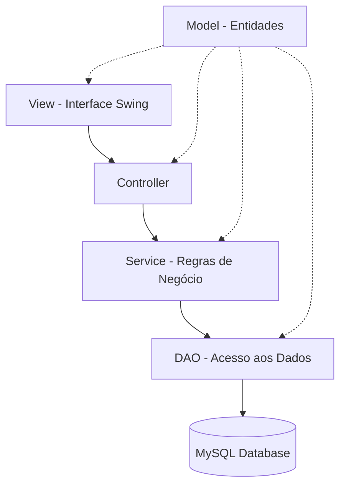

<div align="center">

# 🛍️ Sistema de Gerenciamento de Loja

### *De uma atividade escolar a um projeto de aprendizado completo*

[](https://www.oracle.com/java/)
[](https://www.mysql.com/)
[](LICENSE)

</div>

---

## 📖 Sobre o Projeto

Este projeto começou como uma simples atividade escolar, mas rapidamente se transformou em um projeto pessoal de aprendizado. A ideia inicial era apenas criar um sistema funcional para gerenciar clientes, funcionários e produtos de uma loja, mas ao longo do desenvolvimento, cada nova funcionalidade se tornou uma oportunidade para experimentar e testar.

### 🎯 Propósito

Sistema de gerenciamento de loja desenvolvido em **Java**, com o objetivo de simular e automatizar as principais rotinas administrativas de um ambiente comercial. A aplicação permite o **controle centralizado de informações essenciais**, como clientes, funcionários e produtos, além do **gerenciamento de acessos** por meio de autenticação de usuários.

### 💡 Problemas Resolvidos

- ❌ **Falta de organização** → ✅ Controle centralizado
- ❌ **Dificuldade no controle de cadastros** → ✅ CRUD completo
- ❌ **Risco de inconsistências** → ✅ Validação de dados
- ❌ **Gestão manual descentralizada** → ✅ Sistema integrado

### 🎓 Finalidade Educacional

Este projeto foi desenvolvido visando o aprofundamento prático em:

- ☕ **Java** e **Programação Orientada a Objetos**
- 🖼️ **Construção de interfaces gráficas** com Java Swing
- 🗄️ **Integração com banco de dados** relacional
- 📐 **Modelagem de sistemas** e boas práticas
- 🏗️ **Organização de um projeto desktop** completo

---

## 🎥 Demonstração da Aplicação

> 🔗 **Vídeo de demonstração:** *(adicionar o link do vídeo)*

Apresentação detalhada do funcionamento do projeto, destacando suas principais funcionalidades e fluxos de uso.

---

## ✨ Funcionalidades

<div align="center">
  <table>
<tr>
<td width="50%">

### 👥 Gestão de Pessoas
- ✅ CRUD completo de **Clientes**
- ✅ CRUD completo de **Funcionários**
- ✅ Autenticação de usuários
- ✅ Controle de acesso ao sistema

</td>
<td width="50%">

### 📦 Gestão de Produtos
- ✅ CRUD completo de **Produtos**
- ✅ Validação de dados
- ✅ Organização centralizada
- ✅ Persistência em banco de dados

</td>
</tr>
<tr>
<td width="50%">

### 💰 Gestão de Vendas
- ✅ Registro com data e hora
- ✅ Associação a clientes
- ✅ Associação a funcionários
- ✅ Geração de arquivos **XML** para notas fiscais

</td>
<td width="50%">

### 🎨 Interface e Experiência
- ✅ Interface gráfica em **Swing**
- ✅ Mensagens de feedback
- ✅ Validação de entrada
- ✅ Design desktop intuitivo

</td>
</tr>
</table>
</div>


---

## 🛠️ Tecnologias Utilizadas

<div align="center">

| Tecnologia | Descrição |
|:----------:|-----------|
| ☕ **Java 21** | Linguagem principal (JDK 21) |
| 🖼️ **Java Swing** | Interface gráfica desktop (GUI) |
| 🗄️ **MySQL** | Banco de dados relacional |
| 🔌 **JDBC** | Conexão Java ↔ MySQL |
| 💻 **IDE** | NetBeans / IntelliJ / Eclipse |

</div>

---

## 🏗️ Arquitetura e Padrões

O sistema foi desenvolvido seguindo uma **arquitetura baseada em MVC estendido**, visando melhor organização do código, separação de responsabilidades e maior facilidade de manutenção.



### 📐 Camadas da Aplicação

| Camada | Responsabilidade |
|--------|------------------|
| **Model** | Entidades do sistema e regras básicas de negócio |
| **View** | Interface gráfica desenvolvida em Java Swing |
| **Controller** | Intermediação entre usuário e lógica da aplicação |
| **Service** | Regras de negócio, validações e processamento |
| **DAO** | Abstração e centralização do acesso ao banco de dados |

### 🎯 Princípios Aplicados

- ✅ **POO** — Encapsulamento, Herança, Polimorfismo e Abstração
- ✅ **Separação de responsabilidades**
- ✅ **Organização em camadas**
- ✅ **Nomenclatura consistente**
- ✅ **Tratamento de exceções**
- ✅ **Código legível e manutenível**

---

## 📁 Estrutura do Projeto

O projeto segue uma organização modular e em camadas, facilitando a manutenção e evolução do código.

```
perfumaria-even/
│
├── 📂 src/
│   ├── 📂 app/                    # Executável do Programa
│   │   ├── Main.java
│   │
│   ├── 📂 database/                 # DUMPS do banco     
│   │   ├── db_perfumaria_even_clientes.sql
│   │   ├── db_perfumaria_even_funcionarios.sql
│   │   ├── db_perfumaria_even_produtos.sql
│   │   ├── db_perfumaria_even_vendas.sql


│   ├── 📂 model/                    # Entidades do domínio
│   │   ├── Cliente.java
│   │   ├── Funcionario.java
│   │   ├── Produto.java
│   │   ├── Venda.java
│   │
│   ├── 📂 dao/                      # Acesso a dados (Data Access Object)
│   │   ├── Conexao.java             # Gerenciamento de conexão com o banco
│   │   ├── ClienteDAO.java
│   │   ├── FuncionarioDAO.java
│   │   ├── ProdutoDAO.java
│   │   ├── VendaDAO.java
│   │   └── LoginDAO.java
│   │
│   ├── 📂 service/                  # Regras de negócio e validações
│   │   ├── ClienteService.java
│   │   ├── FuncionarioService.java
│   │   ├── LoginService.java
│   │   ├── ProdutoService.java
│   │   ├── VendaService.java
│   │   └── GeradorDeXMLService.java
│   │
│   ├── 📂 controller/               # Controladores da aplicação
│   │   ├── ClienteController.java
│   │   ├── FuncionarioController.java
│   │   ├── ProdutoController.java
│   │   ├── VendaController.java
│   │   └── LoginController.java
│   │
│   ├── 📂 view/                     # Interface gráfica (Swing)
│   │   ├── 📂 cliente/
│   │   │    ├── AdicionarClientesView.java
│   │   │    ├── AlterarDadosCView.java
│   │   │    ├── ExcluirClientesView.java
│   │   │
│   │   ├── 📂 funcionario/
│   │   │    ├── AdicionarFuncionariosView.java
│   │   │    ├── AlterarDadosFViewView.java
│   │   │    ├── ExcluirFuncionariosView.java
│   │   │
│   │   ├── 📂 imgs/...              # Ícones de Imagens do projeto
│   │   │
│   │   ├── 📂 login/
│   │   │    ├── LoginView.java
│   │   │
│   │   ├── 📂 principal/
│   │   │    ├── PrincipalView.java
│   │   │
│   │   ├── 📂 produto/
│   │   │    ├── AdicionarProdutoView.java
│   │   │    ├── AlterarDadosProdutoView.java
│   │   │    ├── ExcluirProdutosView.java
│   │   │
│   │   ├── 📂 venda/
│   │   │    ├── VendaView.java

│
├── 📂 libraries/                  # Bibliotecas externas (JARs)
    └── mysql-connector-j-9.3.0.jar  # Driver JDBC do MySQL

```

### 📦 Descrição dos Pacotes

| Pacote | Descrição |
|--------|-----------|
| **model** | Contém as classes de entidade que representam os objetos do domínio (Cliente, Produto, etc.) |
| **dao** | Responsável pela comunicação direta com o banco de dados (queries SQL) |
| **service** | Implementa a lógica de negócio, validações e processamento de dados |
| **controller** | Faz a mediação entre a interface (view) e as regras de negócio (service) |
| **view** | Interfaces gráficas desenvolvidas com Java Swing |

### 🔑 Arquivos Importantes

- **Main.java** → Ponto de entrada da aplicação
- **Conexao.java** → Gerencia a conexão com o banco MySQL
- **database/** → Scripts SQL para criação e população do banco
- **libraries/** → Dependências externas (MySQL Connector)

---

## 📋 Pré-requisitos

Antes de executar o projeto, certifique-se de ter instalado:

- ☕ **Java JDK 21** ou superior
- 🗄️ **MySQL Server**
- 💻 **IDE compatível** (NetBeans, IntelliJ IDEA ou Eclipse)
- 🔌 **MySQL Connector/J** (Driver JDBC)

---

## ⚙️ Configuração do Banco de Dados

### 🗄️ Criação do Banco

O banco deve ser criado manualmente no MySQL antes da execução da aplicação.

```sql
CREATE DATABASE db_perfumaria_even;
```

**Nome do banco:** `db_perfumaria_even`

### 📊 Estrutura das Tabelas

Dentro da pasta `database` do projeto estão disponíveis os arquivos de dump contendo a estrutura das tabelas. Importe-os após criar o banco.

### 🔐 Credenciais

- **Usuário:** Utilize um usuário MySQL válido (exemplo: `root`)
- **Senha:** Configure conforme sua instalação
- **Porta:** `3306` (padrão)
- **Charset:** `utf8mb4` (recomendado)

---

## 🔌 Configuração da Conexão

A conexão é realizada através da classe `Conexao.java` no pacote `dao`.

### 📁 Localização

```
src/dao/Conexao.java
```

### 📝 Exemplo de Implementação

```java
package dao;

import java.sql.Connection;
import java.sql.DriverManager;
import java.sql.SQLException;

public class Conexao {
    private static final String url = "jdbc:mysql://localhost:3306/db_perfumaria_even";
    private static final String user = "root";  // ⚠️ Altere conforme seu ambiente
    private static final String password = "sua_senha";  // ⚠️ Altere conforme seu ambiente
    
    private static Connection conn;

    public static Connection getConexao() {
        try {
            if (conn == null) {
                conn = DriverManager.getConnection(url, user, password);
                return conn;
            } else {
                return conn;
            }
        } catch (SQLException e) {
            return null;
        }
    }
}
```

> ⚠️ **Atenção:** Substitua `user` e `password` pelas suas credenciais antes de executar!

---

## 🚀 Como Executar o Projeto

### 1️⃣ Clone o Repositório

```bash
git clone https://github.com/GallegoSz/perfumaria-even.git
cd perfumaria-even
```

### 2️⃣ Importe na IDE

- Abra sua IDE de preferência (NetBeans, IntelliJ IDEA ou Eclipse)
- Importe como **projeto Java existente**

### 3️⃣ Configure o Banco de Dados

- Crie o banco `db_perfumaria_even`
- Importe os dumps da pasta `database`
- Ajuste credenciais em `dao.Conexao`

### 4️⃣ Execute a Aplicação

- Localize a classe principal (**Main**)
- Execute o projeto

🎉 **Pronto!** O sistema está funcionando!

---

## 👤 Usuários de Teste

Para facilitar os testes iniciais, utilize as credenciais abaixo:

<div align="center">

| Campo | Valor |
|:-----:|-------|
| 📧 **Login** | `jopedrogallego@gmail.com` |
| 🔑 **Senha** | `senha` |
| 🛡️ **Acesso** | Administrador |

</div>

> 💡 Este usuário possui acesso completo a todas as funcionalidades do sistema.

---

## 🤝 Contribuição

Este é um projeto **aberto e educacional**. Contribuições são bem-vindas! 

### Como Contribuir

1. 🍴 Faça um **fork** do repositório
2. 🌿 Crie uma **branch** para sua modificação
   ```bash
   git checkout -b feature/minha-feature
   ```
3. ✏️ Realize as alterações necessárias
4. 💾 Commit suas mudanças
   ```bash
   git commit -m "feat: adiciona nova funcionalidade"
   ```
5. 📤 Envie um **Pull Request**

### 📌 Padrão de Commits

Utilize mensagens claras e objetivas seguindo o padrão:

```
feat: adiciona validação de campos no cadastro de produtos
fix: corrige erro na conexão com o banco de dados
docs: atualiza documentação do README
style: formata código seguindo padrão do projeto
refactor: refatora estrutura da classe DAO
```

---

## 👨‍💻 Autor

<div align="center">

### João Pedro Gallego

[](https://github.com/GallegoSz)
[](https://www.linkedin.com/in/joaopedrogallego)
[](mailto:jopedrogallego@outlook.com)

</div>

---

## 📄 Licença

Este projeto está sob a licença MIT. Veja o arquivo [LICENSE](LICENSE) para mais detalhes.

---

<div align="center">

### ⭐ Se este projeto foi útil para você, considere dar uma estrela!

**Desenvolvido com ☕ e 💙 por João Pedro Gallego**

</div>
